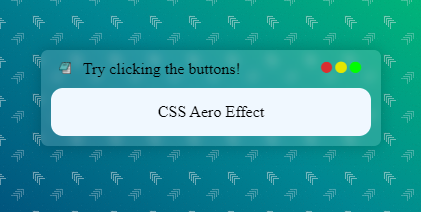

# [Bloc de notas con efecto Aero](https://marfullsen.github.io/bloc-de-notas-aero-effect/)

## ¿Qué es?
Esto es una [página estática](https://marfullsen.github.io/bloc-de-notas-aero-effect/) que recrea el efecto Aero de Windows 7.

## ¿Cómo se logró hacer cada cosa?
La página se compone de tres elementos:
- Efecto Aero hecho con 
    - Color RGBA con transparencia;
    - Filtro de efecto borroso (en inglés *blur*);

- Fondo con textura y gradiente de dos colores.

- Los íconos de los botones rojo, amarillo y verde son de [Font Awesome](https://fontawesome.com/).

## Creditos.
Gracias a [tutsplus](https://webdesign.tutsplus.com/es/tutorials/how-to-create-a-frosted-glass-effect-in-css--cms-32535) por los conocimientos para crear el efecto Aero
Gracias a [transparenttextures](https://www.transparenttextures.com/) por las increíbles texturas.
Gracias a [MyColor.Space](https://mycolor.space/gradient) por la gradiente.
